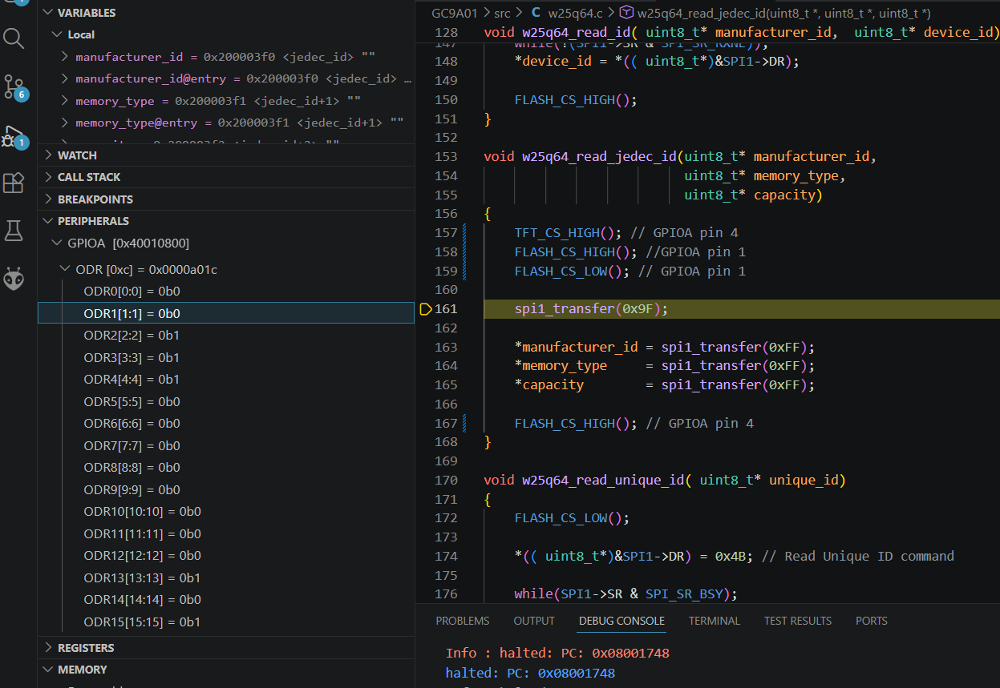
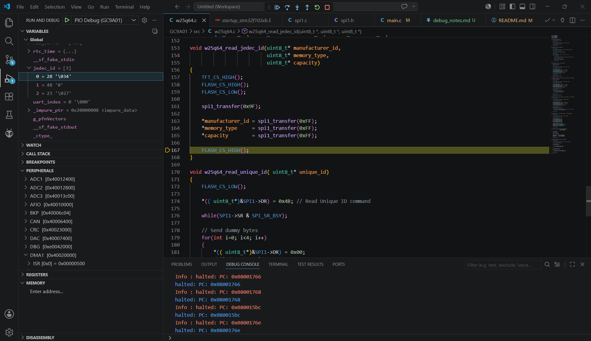

# Debug Notes

---

## 2026-05-28 — W25Q64 SPI Flash Debug Session

### Issue

External SPI flash returned invalid JEDEC response values during initial communication tests.

Observed responses:

* 00 00 00
* 9F 00 00

even though:

* GC9A01 LCD worked correctly
* SPI1 DMA LCD fill worked correctly

---

### Hardware Configuration

Shared SPI1 bus:

| Device     | CS Pin |
| ---------- | ------ |
| GC9A01 LCD | PA4    |
| SPI Flash  | PA1    |

SPI1 pins:

| Signal | STM32 Pin |
| ------ | --------- |
| SCK    | PA5       |
| MISO   | PA6       |
| MOSI   | PA7       |

---

### Debug Process

The following areas were verified step-by-step:

#### SPI1 configuration

Verified:

* master mode
* SPI enable
* TXE/RXNE flags
* SPI clock generation

#### GPIO configuration

Verified:

* PA5 = SCK
* PA6 = MISO
* PA7 = MOSI

#### Shared SPI bus

Verified correct chip select handling:

* LCD CS HIGH during flash communication
* FLASH CS LOW during flash communication

The debugger confirmed proper shared SPI bus ownership handling during flash transactions.

---

#### SPI transfer logic

Implemented full duplex transfer helper:

* TX dummy bytes
* RX synchronization
* RXNE handling

#### Hardware register inspection

Using VSCode debugger:

* SPI1->SR
* RXNE
* TXE
* BSY

The debugger confirmed valid JEDEC response values returned from the external SPI flash device.

---

### Root Cause

SPI Flash DO pin was incorrectly connected to DI instead of MISO.

Incorrect:

* DO -> MOSI

Correct:

* DO -> MISO (PA6)

---

### Flash Verification

After correcting the wiring:

JEDEC response:

* Manufacturer ID: 0x28
* Memory Type: 0x48
* Capacity: 0x23

Capacity byte verification:

2^23 = 8 MB

The flash chip appears to be a Winbond-compatible 64Mbit SPI NOR Flash device.

---

### Result

Verified working:

* SPI RX/TX communication
* Shared SPI bus operation
* External SPI flash detection
* JEDEC ID read
* Status register read
* SPI MISO functionality

---

### Next Steps

Planned:

* sector erase
* page program
* bitmap storage
* bitmap streaming
* DMA accelerated graphics pipeline
